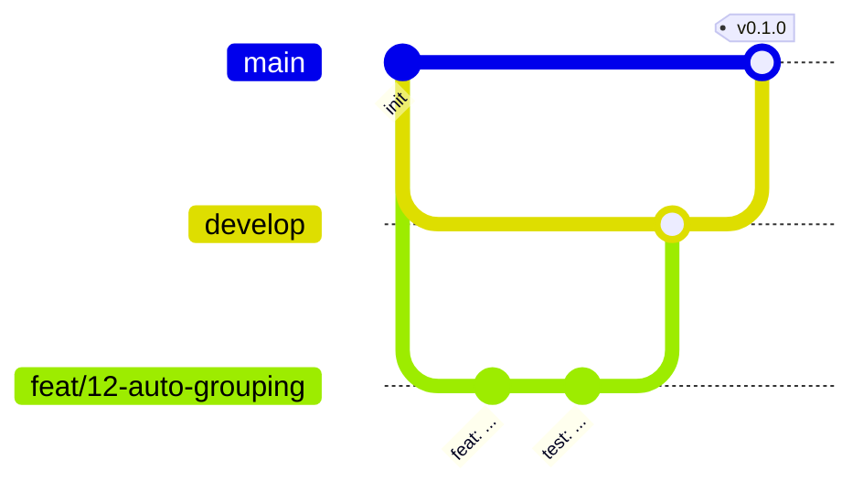

# 0007. main + develop のブランチ戦略とマージコミット

- ステータス：Accepted
- 日付：2026-09-28

## コンテキスト

拡張機能は Chrome ウェブストアで公開するため、「ストアに出したもの」と「開発中のもの」を区別したい。また、1コミット1論理変更を基本としているため、PR 内のコミットの分け方を履歴に残したい。

## 検討した選択肢

### ブランチのモデル

- **GitHub Flow**：`main` と短命の作業ブランチだけで、最も軽い。`main` が常にリリース可能である必要がある
- **main + develop**：`develop` に変更を集め、リリース時に `main` へ取り込む。リリースした状態と開発中の状態を分けられる
- **トランクベース**：`main` に直接、または非常に短命のブランチで頻繁に統合する。PR を必須にしない

### マージ方法

- **スカッシュ**：PR が1コミットにまとまる。PR 内のコミットの分け方は失われる
- **リベース**：PR 内のコミットがそのまま直線的に積まれる。PR の境界は残らない
- **マージコミット**：PR 内のコミットを残しつつ、PR の境界もマージコミットとして残る

## 決定

- `main`（リリース済み）と `develop`（開発の統合先、デフォルトブランチ）の2本を持つ
- 作業ブランチは `develop` から切り、PR で `develop` にマージする。リリースは `develop` → `main` の PR で行う。hotfix は `main` から切り、マージ後に `develop` へ取り込む
- 作業ブランチ名は `<type>/<Issue番号>-<説明>` とし、作業と Issue を結び付ける
- マージはマージコミットのみとする。マージコミットのメッセージには PR のタイトルと本文を使う（PR タイトルを Conventional Commits の形式にする）

## 結果

- PR 内のコミットの分け方が履歴に残るため、PR を出す前にコミットを整理する必要がある
- デフォルトブランチを `develop` にしたため、PR と Renovate の宛先は自動で `develop` になる。デフォルトブランチはマージ後の自動削除の対象外なので、リリース PR をマージしても `develop` は消えない
- `main`・`develop` はルールセットで保護し、直接 push・force push・削除を禁止し、`ci / check` と `build` を必須にしている
- 一人での開発のため、PR の承認は必須にしていない
