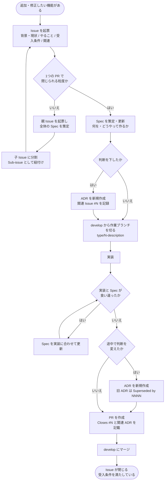

# 0009. Issue・Spec・ADR による作業フロー

- ステータス：Accepted
- 日付：2026-09-29
- 関連 Issue：#9

## コンテキスト

機能の追加・修正をどう進めるかが決まっていなかった。作業の範囲・完了の条件・作るものの定義・判断の理由が、どこに書かれるかが作業ごとにばらつくと、AI エージェントに任せたときに「何をもって終わりか」「なぜそうなっているか」をたどれない。

ブランチ戦略（ADR 0007）で作業ブランチと Issue を結び付け、ADR（ADR 0001）で判断の理由を残すことはすでに決めている。Spec の置き場所として OpenSpec を導入した（ADR 0008）。

## 検討した選択肢

### 作業の単位

- **Issue を単位にする**：受入条件を GitHub 上で見られ、PR のマージで自動的に閉じられる。ブランチ名の規約（`<type>/<Issue番号>-<説明>`）とも合う
- **OpenSpec の change を単位にする**：Spec と作業が1か所にまとまる。一方、GitHub 上で進み具合を追えず、ブランチ名・PR と結び付かない

### 大きな作業の分け方

- **親 Issue と子 Issue（Sub-issue）に分ける**：GitHub の標準機能で、親 Issue に子 Issue の進み具合が表示される。子 Issue ごとに PR を出せる
- **1つの Issue にチェックリストで並べる**：Issue は1つで済むが、1つの PR では閉じられず、「1つの PR で閉じる」という粒度が崩れる

### Stacked PR（前の PR のブランチを起点にした PR）の宛先

- **前の PR のブランチを宛先にする**：差分が自分の変更だけになる。一方、`Closes #N` はデフォルトブランチ（`develop`）へのマージでしか効かないため、Issue が自動で閉じない
- **`develop` を宛先にする**：`Closes #N` が効く。前の PR がマージされるまでは、前の PR の変更も差分に含まれる

## 決定

次の3つを役割で分ける。

- **Issue**：これから取り組む作業の範囲を1つ表す。背景・現状、やること（1つの変更を1行で）、観測できる受入条件、関連する Issue・PR・ドキュメントを書く。PR 本文の `Closes #N` で、マージ時に閉じる
- **Spec**（OpenSpec）：これから作るものの定義。作り始める前に、何を・どうやって作るかを決める（Spec-First）。開発しているあいだは最新に保ち、実装と食い違ったら実装を正として Spec を直す。背景と受入条件は Issue に書き、Spec からは Issue 番号を参照する
- **ADR**：下した判断の記録。判断したときに書き、関連 Issue の `#N` を残す。書いた後は書き換えず、判断を変えるときは新しく作る

Issue は1つの PR で閉じられる粒度にする。大きくなりそうなら親 Issue を作って全体の Spec を決め、子 Issue（Sub-issue）に分ける。Stacked PR にする場合も宛先は `develop` にし、前の PR からマージする。

## 結果

- 作業の範囲と完了の条件は Issue、作るものの定義は Spec、判断の理由は ADR を見ればたどれる
- Issue テンプレート（機能要望）を「背景・現状／やること／受入条件／関連」の構成にし、ADR テンプレートに「関連 Issue」欄を追加した
- 作業のたびに Issue と Spec を書くため、小さな変更でも手間が増える。依存の更新（Renovate）など Spec を持たない作業では、Spec を省いてよい
- Stacked PR では、前の PR がマージされるまで差分が大きく見える
